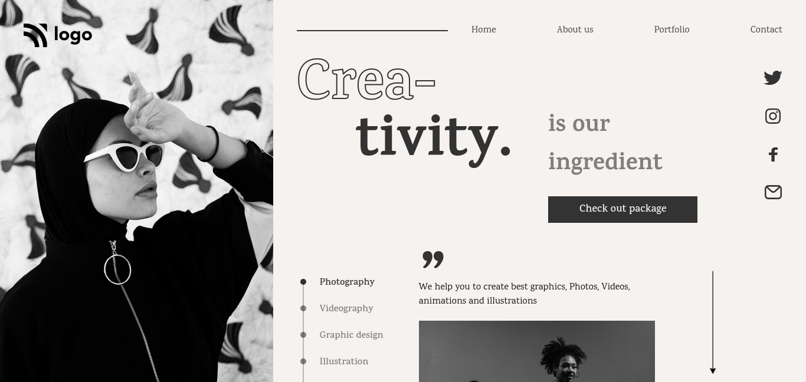

# This is a home page for a Dancing school

## Deployed Link

[Project Link](https://phani-sai-project-15.netlify.app/)

## Preview:

## Built with:

- HTML
- Positons Using CSS Postion and Flexbox

## Key learnings:

- Learned how to add stroke to the text elements and quotes.

## Time taken:

- I took 3 hours to build from scratch and for making responsive it took me extra 40min.

